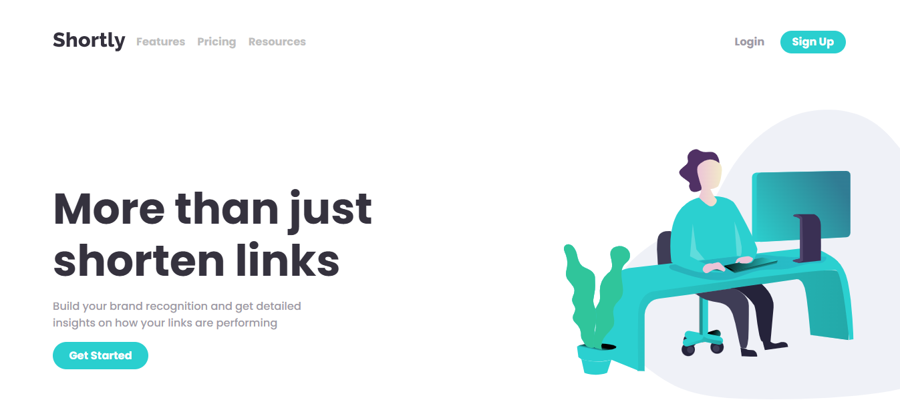

# Shortly URL shortening Website

## Table of contents

  - [Screenshot](#screenshot)
  - [Links](#links)
- [My process](#my-process)
  - [Built with](#built-with)
  - [What I learned](#what-i-learned)
  - [Continued development](#continued-development)
  - [Useful resources](#useful-resources)
- [Author](#author)

### Screenshot

### Links

- Live Site URL: 

## The process

### Built with

- HTML
- CSS 
- React
- Vite
- Mobile-first workflow
- [CleanURI API](https://cleanuri.com/docs) - Link shortening API

### What I learned

 - Use of REST APIs with React
 - How to bypass Cors policy errors with Cors proxy
 - Website loading spinners
 - Mobile first responsive design

### Continued development

 - Working with REST API's
 - Custom React Hooks
 - Vite
 - Mobile first CSS

### Useful resources

- [Cors Anywehre Proxy](https://cors-anywhere.herokuapp.com/corsdemo) - The only Cors proxy that worked for this project. It requires a manual activation after about 10 hours i believe though.

## Author

- Shem

